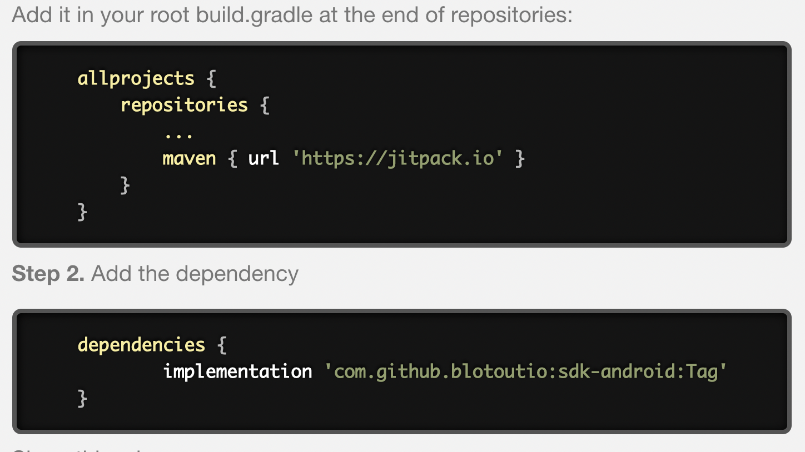

# Integration


## Add Blotout Analytics SDK into your project

To add the SDK to the Android project, Please refer to the image below for recommended settings, click finish.



## Add Required Gradle Dependency and libraries
```kotlin
allprojects {
    repositories {
        maven { url 'https://jitpack.io' }
    }
}

implementation 'com.github.blotoutio:sdk-android:0.9.0'
```


## Initialization

### Option 1 Java: 

 Please initialize the BlotoutAnalytics in Android Application class.

```kotlin
import com.edgetag.analytics.BlotoutAnalytics;

BlotoutAnalyticsConfiguration blotoutAnalyticsConfiguration = new BlotoutAnalyticsConfiguration();
blotoutAnalyticsConfiguration.setBlotoutSDKKey("EADAH5FV8B5MMVZ");
blotoutAnalyticsConfiguration.setEndPointUrl("https://stage.blotout.io/sdk/");
BlotoutAnalytics.INSTANCE.init(this,blotoutAnalyticsConfiguration,new CompletionHandler() {
    @Override
    public void onSuccess() {

    }

    @Override
    public void onError() {

    }
});

```

### Option 2 Kotlin:
```kotlin
var blotoutAnalyticsConfiguration = BlotoutAnalyticsConfiguration()
blotoutAnalyticsConfiguration.blotoutSDKKey = "EADAH5FV8B5MMVZ"
blotoutAnalyticsConfiguration.endPointUrl = "https://stage.blotout.io/sdk/"

BlotoutAnalytics.INSTANCE.init(this,blotoutAnalyticsConfiguration,object : CompletionHandler() {
    @Override
    fun onSuccess() {

    }

    @Override
    fun onError() {

    }
});

```
